# Semantic Segmentation

In this project I trained a Fully Convolutional Network (FCN) to classify each pixel of an image as **ROAD** or **NOT ROAD**.

I used the **KITTI Dataset** avaialable at http://www.cvlibs.net/datasets/kitti/eval_road.php

The dataset consists of 289 training and 290 test images. It contains three different categories of road scenes:

- uu - urban unmarked (98/100)
- um - urban marked (95/96)
- umm - urban multiple marked lanes (96/94)
- urban - combination of the three above

Ground truth has been generated by manual annotation of the images and is available for two different road terrain types:

- road - the road area, i.e, the composition of all lanes, and
- lane - the ego-lane, i.e., the lane the vehicle is currently driving on (only available for category "um").

Ground truth is provided for training images only.

The original paper that made available the **KITTI Dataset** by _Jannik Fritsch et al._ can be found at http://www.cvlibs.net/publications/Fritsch2013ITSC.pdf

The FCN was based on the paper by _Jonathan Long et al._ https://people.eecs.berkeley.edu/~jonlong/long_shelhamer_fcn.pdf


## Predictions

##### Urban Multiple Marked Lanes

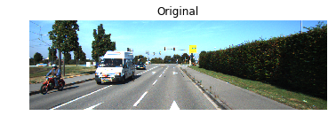

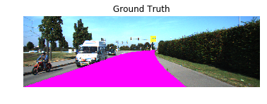

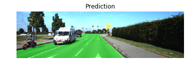


##### Urban Unmarked Lanes

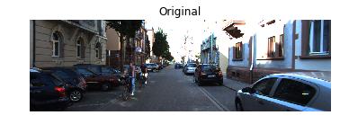


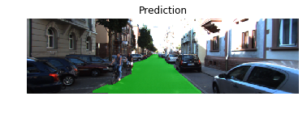


##### Urban Marked Lanes

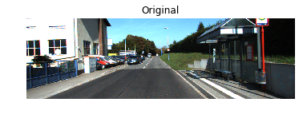

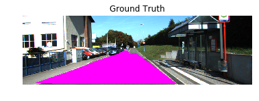

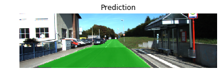


##### Misses

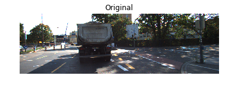

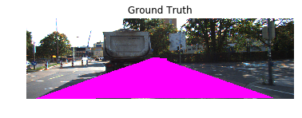

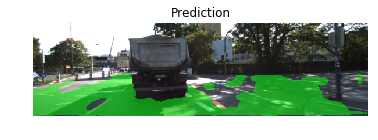


## Model

##### Architecture

Following the paper by Jonathan Long, it uses the original VGG 16 network and replaces the fully connected layers with three 1x1 convolutions for layers 7, 4 and 3, adding skip layers between them.

##### Parameters

- keep_prob: 0.5
- learning_rate: 0.0005
- epochs: 30
- batch_size: 8

After several trials, choosing a keep probability of 0.5, a learning rate of 0.0005 and 30 epochs in batches of 8 images was the run with good results. The loss continually decreased and in the 30th epoch it ended between 0.0200 and 0.0300.

```
  ...
  - loss   0.0242 (images: 8, labels: 8)
  - loss   0.0289 (images: 8, labels: 8)
  - loss   0.0181 (images: 1, labels: 1)
Running epoch 30/100
  ...
```

I run the final model for 100 epochs in batches of 8 images.
It took 50 minutes to complete (GTX 1080) and reached a final loss of about 0.0100

The final network generated the following TensorFlow model when saved:

```
SIZE   NAME
----------------------------------------
513M - model_01.pb
513M - model_01.meta
513M - model_01.ckpt.meta
4.8K - model_01.ckpt.index
1.6G - model_01.ckpt.data-00000-of-00001
```

##### Original

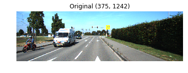

##### Resized


##### Softmax


##### Final Overlay

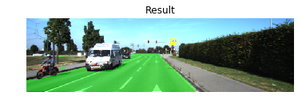


## Model Prediction on Test Images

A few examples from the best model run:

##### Urban Marked Lanes

<table>
<tr>
<td>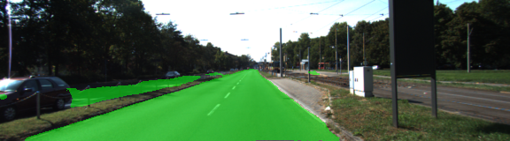</td>
<td>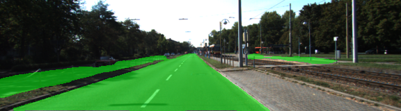</td>
<tr>
<td>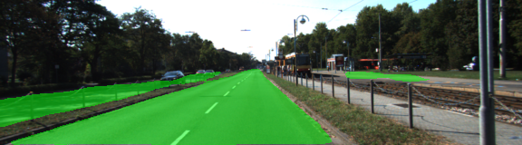</td>
<td>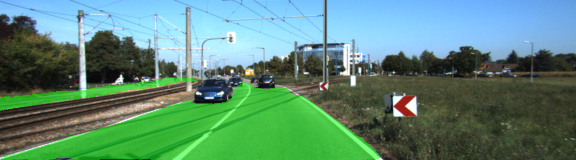</td>
</tr>
<tr>
<td>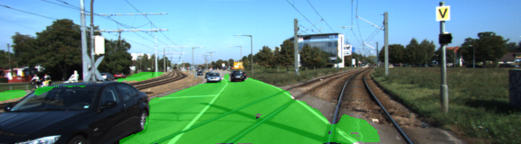</td>
<td>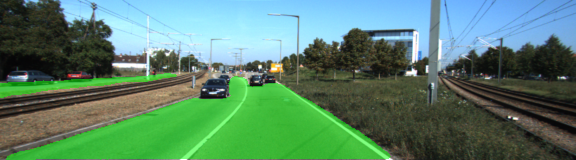</td>
</tr>
<tr>
<td>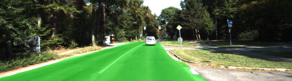</td>
<td>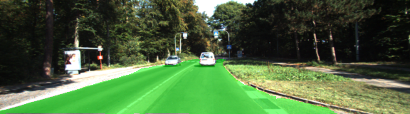</td>
</tr>
<tr>
<td>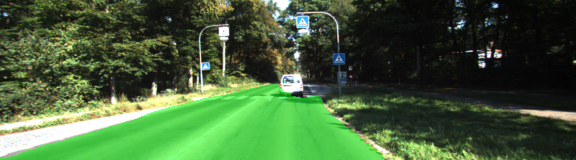</td>
<td>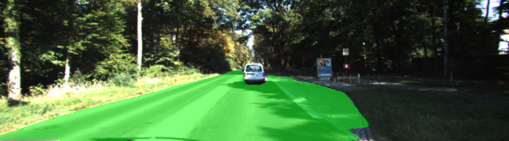</td>
</tr>
<tr>
<td>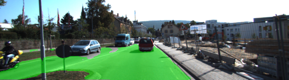</td>
<td>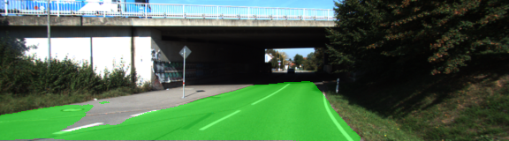</td>
</tr>
<tr>
<td>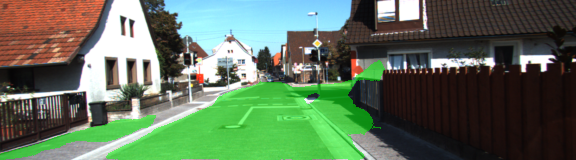</td>
<td></td>
</tr>
<tr>
<td>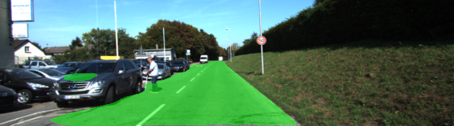</td>
<td>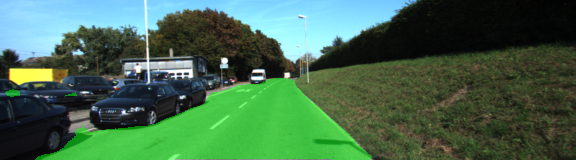</td>
</tr>
<tr>
<td>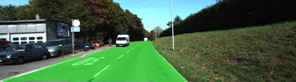</td>
<td>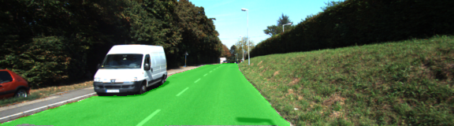</td>
</tr>
<tr>
<td>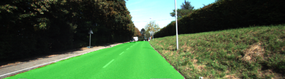</td>
<td>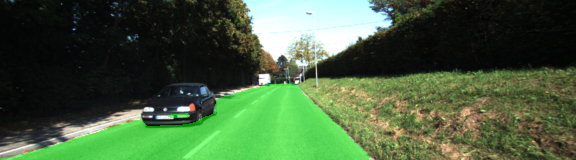</td>
</tr>
</table>

##### Urban Multiple Marked Lanes

<table>
<tr>
<td>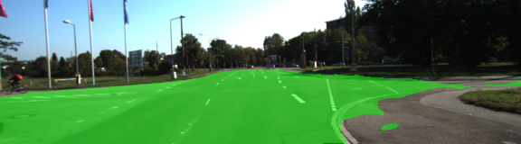</td>
<td>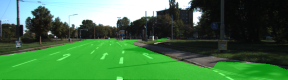</td>
</tr>
<tr>
<td>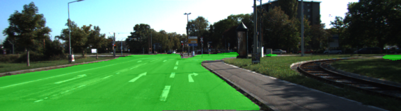</td>
<td>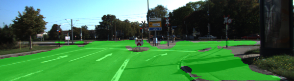</td>
</tr>
<tr>
<td>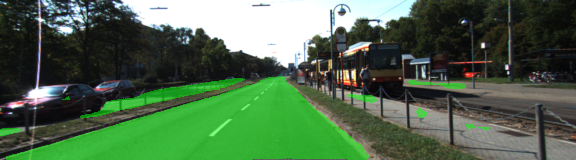</td>
<td>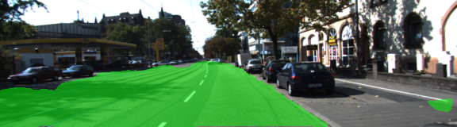</td>
</tr>
<tr>
<td>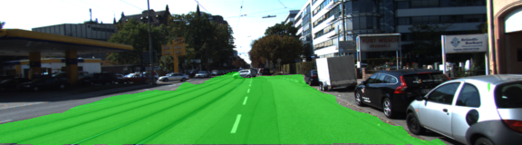</td>
<td>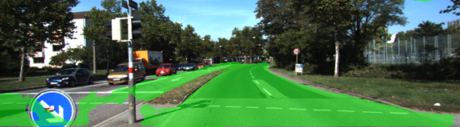</td>
</tr>
<tr>
<td>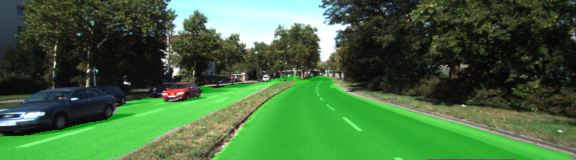</td>
<td>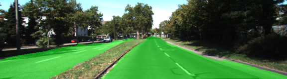</td>
</tr>
</table>

##### Urban Unmarked Lanes

<table>
<tr>
<td>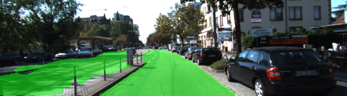</td>
<td>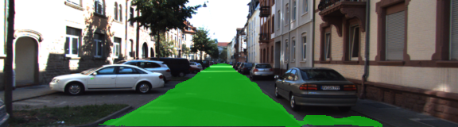</td>
</tr>
<tr>
<td>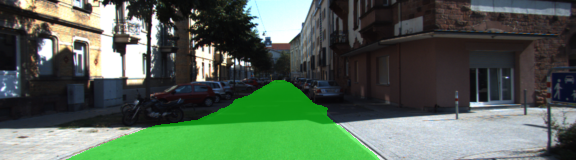</td>
<td>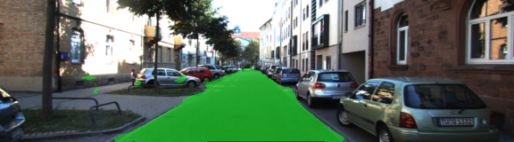</td>
</tr>
<tr>
<td>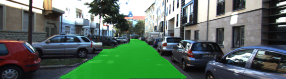</td>
<td>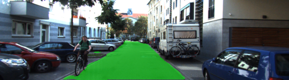</td>
</tr>
<tr>
<td>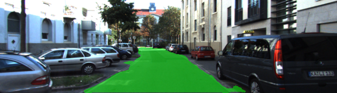</td>
<td>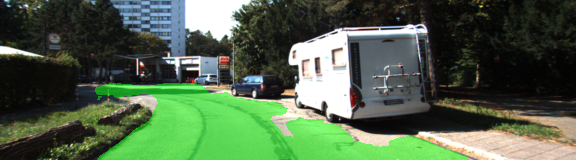</td>
</tr>
<tr>
<td></td>
<td></td>
</tr>
</table>

## Videos

I run the final model in some videos from my dashcam.
The results are remarkable good in portions of the route with similar characteristics than the KITTI dataset.

Considering that none of these images were used for training and the video was completely different, the predictions look good:

<a href="https://youtu.be/CezwSC9et3c?t=1m5s">

<a/>

<a href="https://youtu.be/ZEyXT-Qo2KU?t=1m">

<a/>

<a href="https://youtu.be/Kk2PtPU8hvI?t=1m40s">

<a/>


Complete videos:

- [Route A](https://youtu.be/CezwSC9et3c)
- [Route B](https://youtu.be/ZEyXT-Qo2KU)
- [Route C](https://youtu.be/Kk2PtPU8hvI)


## Notes

When building the initial model, I didn't consider the *kernel_initializer* parameter in the layers (it used the default initializer). That caused the model to generate segmentations with noisy borders:


<table>
<tr>
<th>kernel_initializer with default values</th>
<th>kernel_initializer with truncated normal values</th>
</tr>
<tr>
<td></td>
<td></td>
</tr>
</table>


## References

- [KITTI Dataset avaialable](http://www.cvlibs.net/datasets/kitti/eval_road.php)
- [Udacity's Semantic Segmentation Project](https://github.com/udacity/CarND-Semantic-Segmentation)
- [A quick complete tutorial to save and restore Tensorflow models](http://cv-tricks.com/tensorflow-tutorial/save-restore-tensorflow-models-quick-complete-tutorial/)
